# Secure AWS Web Architecture
 
A security-focused, highly available AWS web architecture designed and implemented as a hands-on cloud security engineering project.
 
This project demonstrates network segmentation, private compute, least-privilege access, encrypted database services, application-layer protection, centralized logging, threat detection, compliance monitoring, failure detection, and controlled resilience testing.
 
> **Project type:** Cloud Security / AWS Infrastructure  
> **Region:** us-east-1  
> **Implementation:** AWS Management Console  
> **Author:** Zay Washington  
> **Year:** 2026
 
---
 
## Architecture
 
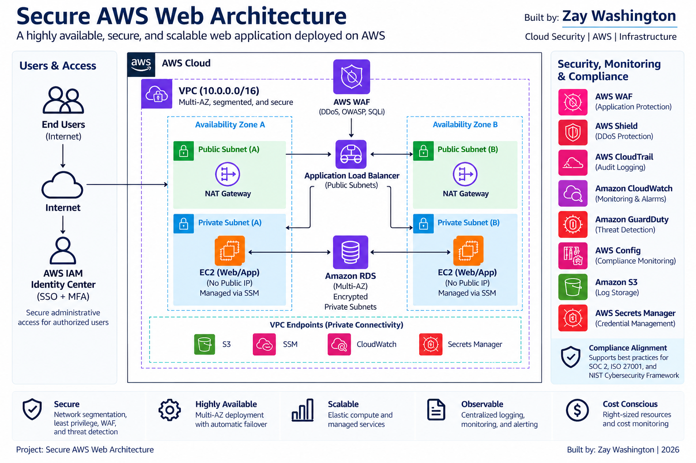
 
The environment uses a segmented multi-AZ VPC with public, application, and database tiers. Internet traffic reaches an Application Load Balancer protected by AWS WAF, while EC2 application servers and Amazon RDS remain privately addressed.
 
Administrative access to the application tier is performed through AWS Systems Manager Session Manager rather than inbound SSH.
 
---
 
## Security Architecture
 
| Layer | Implementation |
|---|---|
| Identity | IAM Identity Center with MFA and administrative permission sets |
| Edge Security | AWS WAF with AWS managed rules and rate limiting |
| Network | Segmented VPC across two Availability Zones |
| Load Balancing | Internet-facing Application Load Balancer |
| Compute | Two private Amazon EC2 application servers |
| Administration | AWS Systems Manager Session Manager; no inbound SSH |
| Database | Private Amazon RDS for MySQL |
| Secrets | AWS Secrets Manager |
| Encryption | AWS KMS |
| Audit Logging | AWS CloudTrail with encrypted S3 delivery and log validation |
| Monitoring | Amazon CloudWatch alarms and Amazon SNS notifications |
| Threat Detection | Amazon GuardDuty |
| Compliance | AWS Config managed rules |
| Cost Governance | AWS Budget with staged actual-cost alerts |
 
---
 
## Network Design
 
The VPC was divided into six subnets across two Availability Zones:
 
- 2 public subnets
- 2 private application subnets
- 2 private database subnets
 
The public tier provides ingress for the Application Load Balancer and controlled Internet connectivity. Application and database workloads do not have public IPv4 addresses.
 
A NAT Gateway was used for controlled outbound connectivity from the private application tier. For this lab, a single NAT Gateway was intentionally used to control cost. A production design could deploy a NAT Gateway per Availability Zone to remove that single-AZ egress dependency.
 
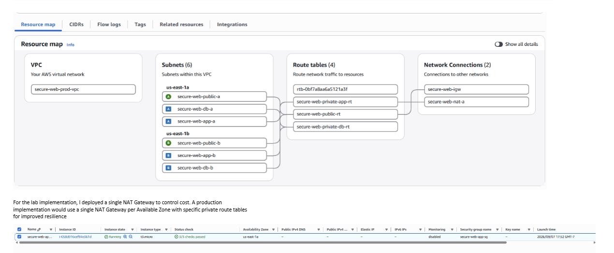
 
---
 
## Identity and Administrative Access
 
Administrative access was configured through IAM Identity Center rather than using the AWS root identity for routine administration.
 
EC2 administration uses Systems Manager Session Manager, eliminating the need for:
 
- Public EC2 IP addresses
- SSH key pairs
- Inbound TCP/22 access
- Bastion-host administration
 
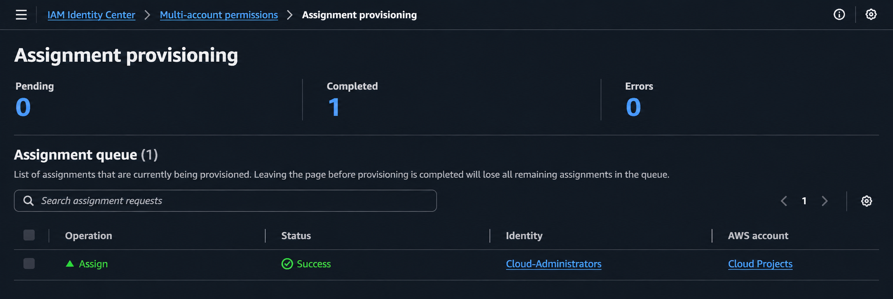
 
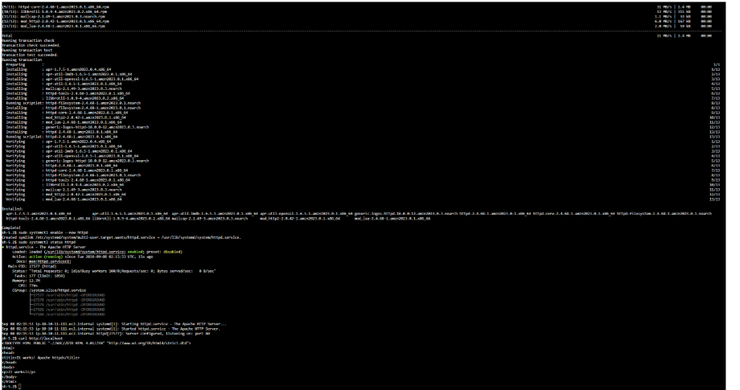
 
---
 
## Private Multi-AZ Compute
 
Two EC2 application servers were deployed across separate Availability Zones.
 
Both instances:
 
- Reside in private application subnets
- Have no public IPv4 address
- Require IMDSv2
- Use an IAM instance role
- Are administered through Systems Manager
- Receive application traffic only from the ALB security group
 
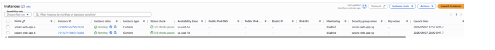
 
---
 
## Load Balancing and Resilience
 
An Application Load Balancer distributes HTTP traffic between both private application servers.
 
Health checks continuously evaluate backend availability.
 
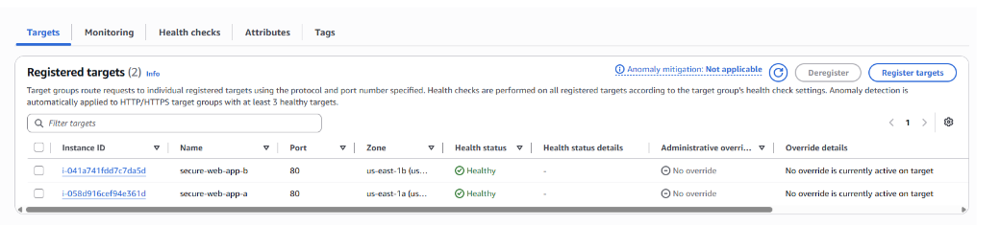
 
A controlled failure test was performed by stopping one application instance. The failed target was removed from service while the remaining healthy target continued serving application traffic from the second Availability Zone.
 
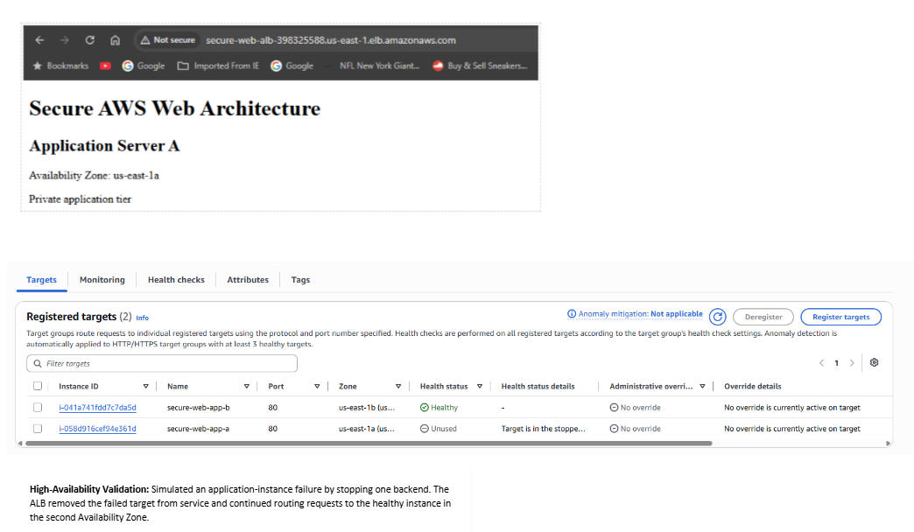
 
---
 
## Private Database and Secrets Management
 
Amazon RDS for MySQL was deployed in private database subnets and configured without public accessibility.
 
Database storage is encrypted using AWS KMS, while the master credentials are managed through AWS Secrets Manager.
 
The EC2 workload role was granted permission to retrieve only the required database secret.
 
Private application-to-database connectivity was validated over TCP/3306, followed by an authenticated SQL operation.
 
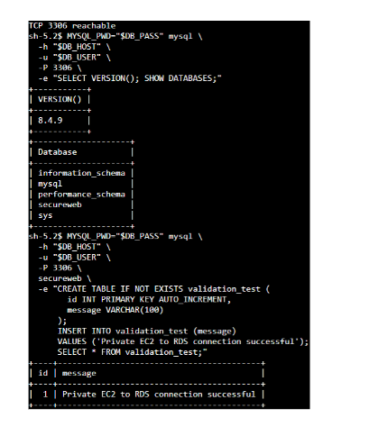
 
---
 
## Logging and Auditability
 
AWS CloudTrail provides API-level audit logging for the environment.
 
The trail was configured with:
 
- Multi-Region logging
- Read/write management events
- S3 log delivery
- AWS KMS encryption
- Log file validation
 
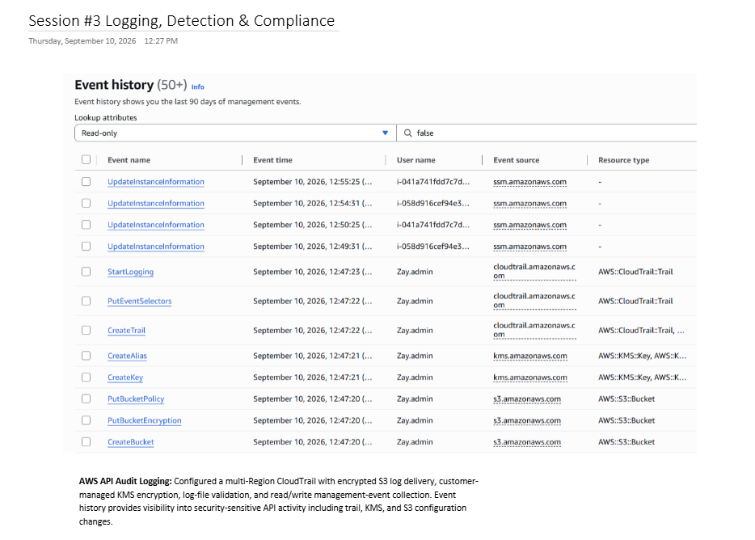
 
CloudTrail log and digest delivery were also validated in Amazon S3.
 
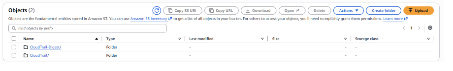
 
---
 
## Monitoring and Failure Detection
 
Amazon CloudWatch monitors Application Load Balancer target health using `UnHealthyHostCount`.
 
A controlled backend failure caused the alarm to transition:
 
**OK → ALARM → OK**
 
Amazon SNS successfully executed the configured notification action.
 
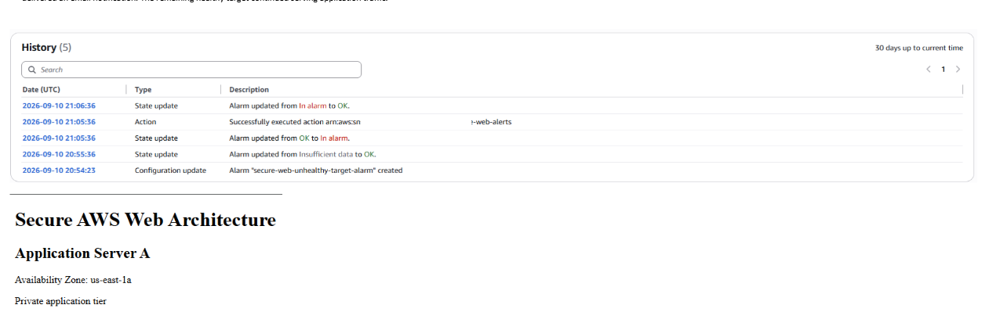
 
---
 
## Threat Detection
 
Amazon GuardDuty was enabled for managed threat detection.
 
AWS-generated sample findings were used to practice security triage without generating malicious activity.
 
A critical compromised-credential attack sequence was investigated, including correlated signals associated with suspicious IAM activity, a Tor exit node, CloudTrail defense-evasion behavior, and MITRE ATT&CK tactics.
 
> The GuardDuty finding shown below is an **AWS-generated sample finding**, not evidence of an actual compromise.
 
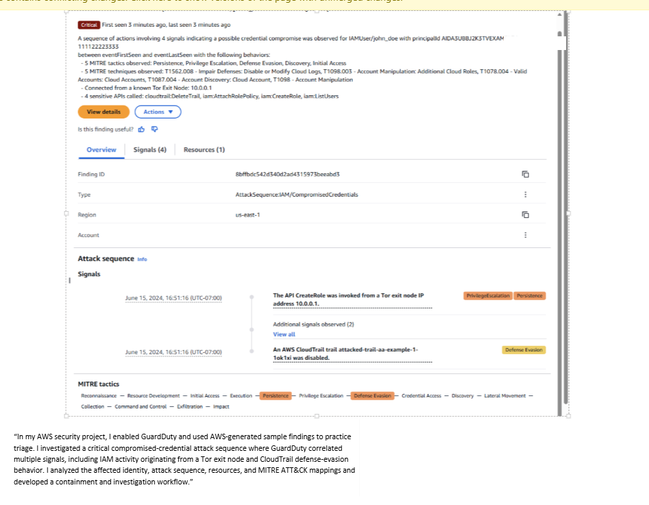
 
---
 
## Continuous Compliance
 
AWS Config continuously evaluated security controls relevant to the architecture.
 
The final environment achieved compliant evaluations for all six selected controls:
 
| AWS Config Rule | Result |
|---|---|
| `cloud-trail-encryption-enabled` | Compliant |
| `cloud-trail-enabled` | Compliant |
| `rds-instance-public-access-check` | Compliant |
| `rds-storage-encrypted` | Compliant |
| `restricted-ssh` | Compliant |
| `s3-account-level-public-access-blocks` | Compliant |
 
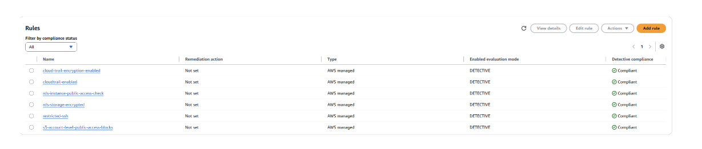
 
During validation, account-level S3 Block Public Access was found disabled. The configuration was investigated and hardened, after which AWS Config reevaluated the control as compliant.
 
---
 
## AWS WAF Validation
 
AWS WAF protects the public Application Load Balancer using:
 
- AWS Managed Core Rule Set
- AWS Managed Known Bad Inputs Rule Set
- AWS Managed SQL Injection Rule Set
- Custom source-IP rate limiting
 
A controlled SQL-injection-shaped HTTP request was sent to validate enforcement.
 
The request received:
 
**HTTP 403 Forbidden**
 
WAF telemetry confirmed that the request was blocked by `AWSManagedRulesSQLiRuleSet`, while legitimate application requests remained allowed.
 
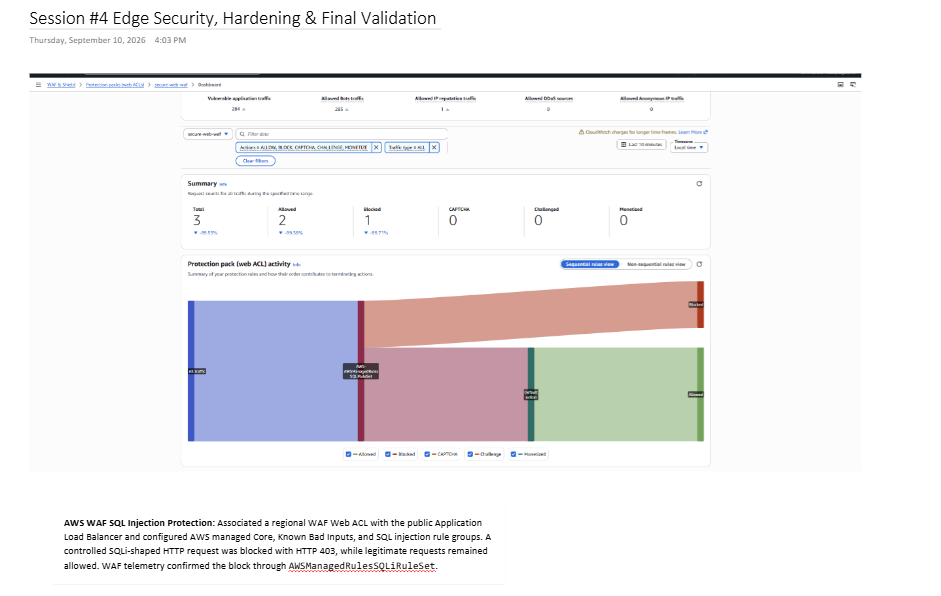
 
---
 
## Security Group Trust Model
 
The architecture uses security-group references rather than exposing internal tiers directly to the Internet.
 
```text
Internet
   |
   | HTTP :80
   v
ALB Security Group
   |
   | HTTP :80
   v
Application Security Group
   |
   | MySQL :3306
   v
Database Security Group
```
 
Only the Application Load Balancer accepts application traffic directly from the Internet.
 
---
 
## Validation Results
 
| Test | Result |
|---|---|
| Normal Internet → application traffic | Passed |
| WAF SQL injection test | Blocked — HTTP 403 |
| Both ALB targets healthy | Passed |
| Single application-instance failure | Application remained available |
| EC2 public IPv4 exposure | None |
| Inbound SSH | None |
| Systems Manager administration | Passed |
| Private EC2 → RDS TCP/3306 | Passed |
| Authenticated MySQL operation | Passed |
| RDS public accessibility | Disabled |
| RDS encryption | Enabled |
| CloudTrail logging | Enabled |
| CloudWatch/SNS failure alert | Passed |
| GuardDuty sample-finding triage | Completed |
| AWS Config compliance | 6/6 compliant |
 
---
 
## Key Security Decisions
 
This project intentionally emphasized several security principles:
 
**Minimize public exposure** — Only the load-balancing tier requires direct Internet reachability.
 
**Segment trust boundaries** — Public, application, and database workloads use separate subnets and security groups.
 
**Eliminate inbound SSH** — Systems Manager provides administrative access to private EC2 instances.
 
**Use workload identity** — EC2 accesses AWS services through an IAM role rather than embedded credentials.
 
**Protect secrets** — Database credentials are managed in Secrets Manager.
 
**Encrypt sensitive data** — RDS and CloudTrail use AWS KMS-backed encryption.
 
**Centralize visibility** — CloudTrail, CloudWatch, GuardDuty, Config, and WAF provide complementary security telemetry.
 
**Validate controls** — Failover, database connectivity, alerting, compliance, and WAF enforcement were tested rather than assumed.
 
---
 
## Cost-Conscious Lab Design
 
This environment was designed as a temporary portfolio lab.
 
Cost controls included:
 
- A recurring $20 AWS Budget
- Actual-cost alerts at 50%, 75%, and 100%
- A single NAT Gateway for the lab implementation
- Controlled CloudWatch log retention
- A focused AWS Config rule set
- Avoidance of unnecessary premium WAF protections
 
The architecture also includes a documented teardown process for billable resources.
 
---
 
## Skills Demonstrated
 
`AWS` · `Cloud Security` · `VPC` · `IAM` · `IAM Identity Center` · `EC2` · `Systems Manager` · `Application Load Balancer` · `RDS` · `Secrets Manager` · `KMS` · `CloudTrail` · `CloudWatch` · `SNS` · `GuardDuty` · `AWS Config` · `AWS WAF` · `S3` · `Network Segmentation` · `High Availability` · `Security Monitoring` · `Incident Triage`
 
---
 
## Project Status
 
**AWS implementation:** Complete  
**Security validation:** Complete  
**Portfolio documentation:** Complete
 
This project represents the manually implemented version of the architecture. Infrastructure-as-Code automation with Terraform is planned as a subsequent iteration.
 
---
 
## Author
 
**Zay Washington**
 
Cloud Security | AWS | Infrastructure
 
GitHub: [ZayWashington](https://github.com/ZayWashington)
